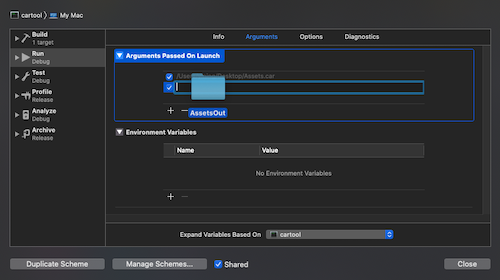
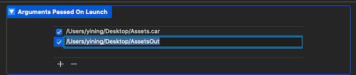
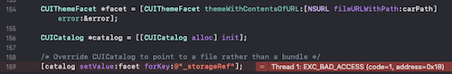
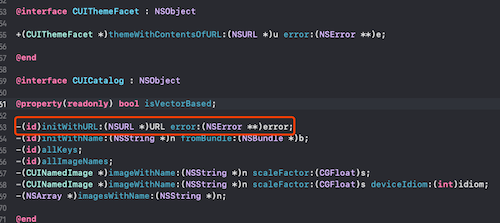
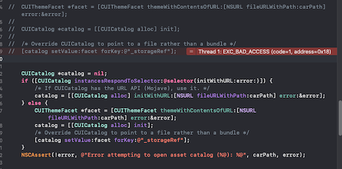

概述：<br>
在借鉴(抄袭)或学习一个APP的时候，总是情不自禁的想直接使用人家的图片资源，在拿到iPA或者在MAC下的应用程序里，图片资源一般是`Assets.car`，这里我们介绍下如何打开这个文件

<!-- more -->

## 工具

cartool：[Github地址](https://github.com/steventroughtonsmith/cartool)

## 使用方式

很简单，download到本地后，按照以下步骤，即可直接运行程序获取图片资源:

1. 找到 cartool -> Edit Scheme -> Run -> Arguments 
2. 在 Ayguments Passed On Launch 配置如下参数：

*`第一个是Assets.car文件路径，第二个是图片文件输出的文件夹路径`*

3. 运行程序，完成破解

## 运行报错

**在macOS系统上，有时可能会报错**



**按照以下方式修改即可**

1. 添加初始化方法

```objectivec
-(id)initWithURL:(NSURL *)URL error:(NSError **)error;
```
2. 修改代码

```objc
//	CUIThemeFacet *facet = [CUIThemeFacet themeWithContentsOfURL:[NSURL fileURLWithPath:carPath] error:&error];
//
//	CUICatalog *catalog = [[CUICatalog alloc] init];
//
//	/* Override CUICatalog to point to a file rather than a bundle */
//	[catalog setValue:facet forKey:@"_storageRef"];
	
    CUICatalog *catalog = nil;
    if ([CUICatalog instancesRespondToSelector:@selector(initWithURL:error:)]) {
        /* If CUICatalog has the URL API (Mojave), use it. */
        catalog = [[CUICatalog alloc] initWithURL:[NSURL fileURLWithPath:carPath] error:&error];
    } else {
        CUIThemeFacet *facet = [CUIThemeFacet themeWithContentsOfURL:[NSURL fileURLWithPath:carPath] error:&error];
        catalog = [[CUICatalog alloc] init];
        /* Override CUICatalog to point to a file rather than a bundle */
        [catalog setValue:facet forKey:@"_storageRef"];
    }
    NSCAssert(!error, @"Error attempting to open asset catalog (%@): %@", carPath, error);
```

