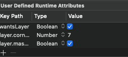
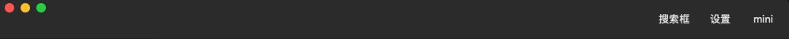

概述：<br>
简单介绍MacOS开发中如何自定义TitleBar

<!-- more -->

## 默认样式

默认的样式如下，无论是可选中的范围还是样式都比较有局限性


## 目标示例样式

期待的样式如下，选中的范围`变高`，内容更自由和丰富
>选中范围变大意味着什么？Mac上可以通过拖拽TitleBar来移动整个Window窗口，范围变大则操作更舒服


## 思路 

-  NSWindow上的Titlebar可以被隐藏；
-  NSView可以通过重写mouseDownCanMoveWindow来控制长按移动窗口

## 步骤

- 自定义CustomWindow，继承自NSWindow，然后在Storyboard中将Window的Class改为CustomWindow
- 重新initWithContentRect方法，并隐藏Titlebar，并设置内容铺满整个window（fullSizeContentView）

  ```swift
    class CustomWindow: NSWindow {
        // 个别属性可以在Storyboard里直接设置，这里都用代码写了
        override init(contentRect: NSRect, styleMask style: NSWindow.StyleMask, backing backingStoreType: NSWindow.BackingStoreType, defer flag: Bool) {
            // styleMask 默认是 [.titled, .closable, .miniaturizable, .resizable]
            super.init(contentRect: contentRect,
                       styleMask:[.titled, .closable, .miniaturizable, .resizable, .fullSizeContentView],
                       backing: backingStoreType,
                       defer: flag)
            // titlebar透明
            titlebarAppearsTransparent = true
            // 隐藏title
            titleVisibility = NSWindow.TitleVisibility.hidden
            // 点击窗口背景支持鼠标拖动窗口
            isMovableByWindowBackground = true
            // 设置透明背景
            isOpaque = false
            backgroundColor = NSColor.clear
        }
    }
  ```

- 自定义一个NSView，设定好高度和位置代替原Titlebar
- 此时拖拽窗口的任何位置都可以移动window，那么就要把rootView的mouseDownCanMoveWindow重写为false，CustomTitleBae的mouseDownCanMoveWindow重写为true

    ```swift
    override var mouseDownCanMoveWindow: Bool {
        return true; // 该属性默认为true
    }
    ```
- 最后记得给rootView设置圆角，不然默认是没有圆角的(我这里直接Storyboard里设置了)

```swift
wantsLayer = true
layer.cornerRadius = 7.0
layer.masksToBounds = true
```

## 最终效果


